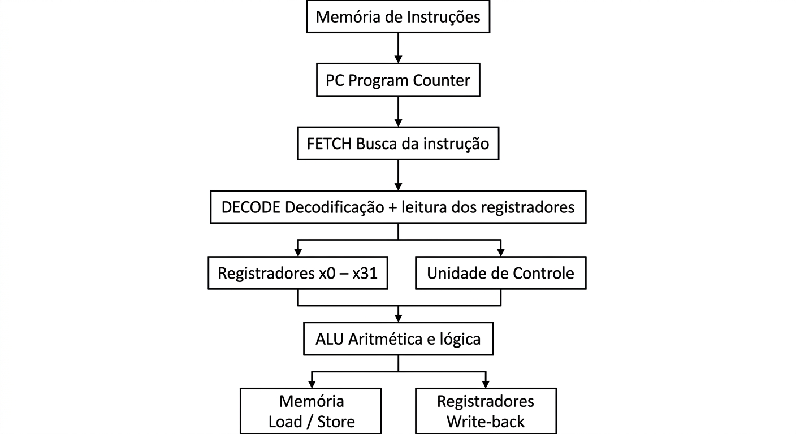

# 3. CPU

## 3.1 Processor Overview

A CPU baseada na arquitetura RISC-V é responsável por executar as instruções definidas pela ISA (Instruction Set Architecture). A arquitetura utiliza um modelo **load/store**, no qual as operações aritméticas e lógicas são realizadas principalmente sobre os registradores, enquanto as instruções de load e store são responsáveis pelo acesso à memória.

Uma implementação típica de um processador RISC-V possui unidades para busca e decodificação de instruções, banco de registradores, unidade lógico-aritmética (ALU), unidade de controle e interfaces para comunicação com a memória. Entretanto, a especificação RISC-V define principalmente o comportamento que o processador deve apresentar, e não uma organização física única. Dessa forma, diferentes processadores RISC-V podem utilizar arquiteturas internas, pipelines e técnicas de execução diferentes.

## 3.2 Registers

Na base RV32I, o processador possui **32 registradores inteiros de propósito geral**, identificados de `x0` a `x31`, cada um com 32 bits. No RV64I, os mesmos 32 registradores possuem 64 bits.

O registrador `x0` possui uma característica especial: seu valor é permanentemente zero e escritas nele não alteram seu conteúdo. Os demais registradores (`x1` a `x31`) podem armazenar valores utilizados pelas instruções aritméticas, lógicas e de transferência de dados.

Além dos registradores de propósito geral, existe o **PC (Program Counter)**, que mantém o endereço da instrução que está sendo executada. Em implementações que utilizam extensões ou a arquitetura privilegiada, também podem existir outros conjuntos de registradores, como registradores de ponto flutuante e CSRs (Control and Status Registers).

## 3.3 ALU

A **ALU (Arithmetic Logic Unit)** é a unidade responsável por realizar operações aritméticas e lógicas necessárias à execução das instruções. Em uma implementação RISC-V, ela pode realizar operações como adição, subtração, comparações, AND, OR, XOR e deslocamentos.

Por exemplo, as instruções `ADD` e `SUB` utilizam operações aritméticas, enquanto `AND`, `OR` e `XOR` realizam operações lógicas sobre os valores armazenados nos registradores.

A especificação da RISC-V define quais operações as instruções devem realizar, mas não determina uma implementação física específica da ALU. Assim, a estrutura e a quantidade de unidades de execução podem variar entre diferentes processadores RISC-V.

## 3.4 Control Unit

A **Unidade de Controle** é responsável por interpretar as instruções e gerar os sinais necessários para que as diferentes partes do processador realizem a operação solicitada.

Durante a decodificação, os campos da instrução identificam a operação, os registradores utilizados e, quando necessário, os valores imediatos. A codificação RISC-V foi projetada para manter os campos dos registradores-fonte e destino em posições consistentes entre os diferentes formatos, facilitando a decodificação e a implementação do hardware.

A RISC-V não especifica uma unidade de controle física única. Processadores diferentes podem utilizar implementações distintas, incluindo projetos simples e processadores mais complexos e paralelos.

## 3.5 Clock

O **clock** fornece uma referência temporal para a operação síncrona do processador, permitindo que seus componentes realizem suas operações de forma coordenada.

Entretanto, a frequência do clock **não é definida pela arquitetura RISC-V**. Ela depende da implementação específica do processador, de sua tecnologia de fabricação, do projeto do circuito e de outros fatores. Portanto, não existe uma frequência de clock padrão para CPUs RISC-V.

A arquitetura define, por exemplo, um contador de ciclos (`cycle`) que pode ser disponibilizado por meio das interfaces arquiteturais, mas isso não estabelece uma frequência específica para o processador.

## 3.6 Instruction Cycle

O ciclo de execução de uma instrução em uma implementação RISC-V pode ser descrito de forma simplificada pelas etapas de **Fetch, Decode e Execute**. A quantidade exata de ciclos e a divisão dessas etapas dependem da implementação do processador.

### Fetch

Na etapa de **Fetch**, o processador utiliza o **Program Counter (PC)** para determinar o endereço da próxima instrução. A instrução é obtida da memória ou do sistema de armazenamento de instruções e encaminhada para as etapas seguintes. Após isso, o PC normalmente é atualizado para apontar para a próxima instrução, embora instruções de salto e desvio possam alterar esse comportamento.

### Decode

Na etapa de **Decode**, a instrução é interpretada para identificar qual operação deve ser realizada. São analisados campos como opcode, registradores-fonte, registrador-destino e valores imediatos.

A RISC-V utiliza diferentes formatos de instrução, como R, I, S e U na base RV32I. A organização desses formatos mantém os identificadores dos registradores em posições consistentes, facilitando o processo de decodificação.

### Execute

Na etapa de **Execute**, a operação indicada pela instrução é efetivamente realizada. Dependendo do tipo de instrução, isso pode envolver a ALU, acesso à memória, cálculo de um endereço ou alteração do fluxo de execução.

Por exemplo, uma instrução `ADD` realiza uma operação aritmética entre dois registradores. Já uma instrução `LW` calcula um endereço e carrega um valor da memória para um registrador. Na arquitetura RISC-V, somente as instruções de load e store acessam diretamente a memória para transferência de dados, enquanto as operações aritméticas trabalham sobre registradores.

Após a execução, algumas instruções precisam ainda escrever o resultado em um registrador ou concluir uma operação de memória. Em processadores com pipeline, essas atividades podem ser distribuídas em diferentes estágios.

## 3.7 CPU Diagram

**Diagrama simplificado de uma implementação de CPU RISC-V:**

O diagrama representa uma organização simplificada. A RISC-V não exige exatamente essa estrutura interna; processadores reais podem utilizar pipelines, múltiplas unidades de execução, caches e outras técnicas de microarquitetura.

## 3.8 Advantages

* **Arquitetura simples:** a base RISC-V foi projetada para reduzir a complexidade necessária em uma implementação mínima.
* **Conjunto de instruções modular:** extensões podem ser adicionadas à base conforme as necessidades da aplicação.
* **Grande quantidade de registradores:** a base RV32I/RV64I possui 32 registradores inteiros, permitindo manter mais valores próximos das unidades de execução.
* **Flexibilidade de implementação:** diferentes fabricantes podem criar processadores RISC-V com diferentes níveis de complexidade e desempenho.
* **Possibilidade de customização:** a arquitetura reserva espaço para extensões personalizadas, permitindo adaptações para aplicações específicas.

## 3.9 Limitations

* **A ISA não define uma implementação completa de CPU:** características como frequência do clock, quantidade de unidades de execução, tamanho dos caches e organização do pipeline dependem do projeto de cada processador.
* **Desempenho depende da implementação:** utilizar RISC-V não determina automaticamente um determinado nível de desempenho, pois processadores podem ter microarquiteturas muito diferentes.
* **Extensões podem afetar compatibilidade:** softwares podem depender de determinadas extensões além da base, sendo necessário utilizar uma implementação que ofereça as extensões exigidas.
* **Maior complexidade em implementações avançadas:** embora a base seja adequada para implementações simples, processadores RISC-V destinados a aplicações de alto desempenho podem incorporar pipelines profundos, execução fora de ordem, múltiplos núcleos e outras estruturas complexas.

Assim, a principal característica da CPU RISC-V é a separação entre a **ISA**, que define o comportamento e as instruções disponíveis, e a **microarquitetura**, que determina como essas instruções serão efetivamente executadas no hardware.
