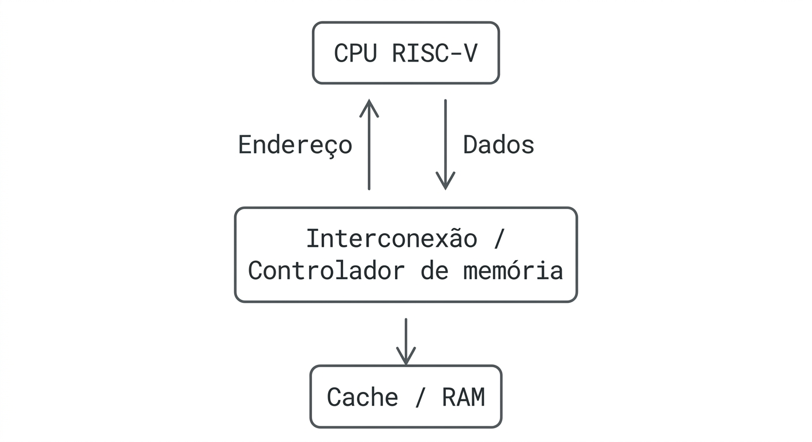

# 5. Bus Architecture

## 5.1 Bus Overview

A arquitetura RISC-V não define um barramento único ou um protocolo de comunicação específico para conectar o processador à memória e aos periféricos. A RISC-V é uma **ISA (Instruction Set Architecture)**, responsável principalmente por definir as instruções, registradores e comportamentos que devem ser observados pelo software.

A forma como o núcleo RISC-V se comunica fisicamente com memória, periféricos e outros componentes depende da implementação do processador ou SoC. Dessa forma, diferentes sistemas RISC-V podem utilizar diferentes interconexões e protocolos de comunicação.

Portanto, conceitos tradicionais como **barramento de dados, barramento de endereços e barramento de controle** podem ser utilizados para explicar funcionalmente a comunicação de um sistema RISC-V, mas não representam três barramentos físicos obrigatórios definidos pela especificação. A própria especificação permite diferentes organizações de microarquitetura e interconexão.

## 5.2 Data Bus

O **barramento de dados** é responsável pela transferência dos valores entre o processador e os componentes de memória ou dispositivos.

Em um sistema RISC-V, as instruções de load e store são utilizadas para realizar transferências de dados entre os registradores e o espaço de memória. Por exemplo, uma instrução `LW` pode carregar uma palavra da memória para um registrador, enquanto `SW` pode armazenar o conteúdo de um registrador na memória.

A RISC-V utiliza um espaço de endereçamento **endereçável por byte**, e o tamanho dos dados manipulados depende da implementação e das instruções disponíveis. Em RV32, por exemplo, uma palavra possui 32 bits, enquanto RV64 também pode trabalhar com dados de 64 bits.

A largura física do caminho de dados utilizado para realizar essas transferências, entretanto, não precisa ser interpretada como um único "barramento RISC-V", pois pode variar de acordo com a microarquitetura.

## 5.3 Address Bus

O **barramento de endereços** é utilizado para indicar a localização de memória ou dispositivo que será acessado.

Quando uma instrução de load ou store é executada, o processador calcula um endereço que identifica a posição que será lida ou escrita. Esse endereço é então utilizado pelo sistema de memória para localizar o recurso correspondente.

A arquitetura RISC-V possui um espaço de endereçamento definido pela implementação. As bases RV32I e RV64I utilizam arquiteturas de 32 e 64 bits, respectivamente, relacionadas ao tamanho dos registradores inteiros e ao espaço de endereçamento.

Além da memória principal, diferentes regiões do espaço de endereços podem representar dispositivos de entrada e saída. A própria especificação estabelece que o ambiente de execução determina como os recursos de hardware são mapeados nesse espaço.

## 5.4 Control Bus

O **barramento de controle**, no modelo tradicional, transporta sinais que indicam como uma determinada operação deve ser realizada. Entre os exemplos estão sinais relacionados a leitura, escrita, sincronização e controle de acesso.

Em uma implementação RISC-V moderna, esses sinais não necessariamente aparecem como um barramento físico único. Eles podem ser distribuídos entre diferentes sinais internos da CPU, controladores de memória e protocolos de interconexão.

A ISA RISC-V define o comportamento das operações de memória e sua ordenação, mas não determina uma implementação física específica desses sinais. O modelo de memória **RVWMO (RISC-V Weak Memory Ordering)** estabelece regras para a ordenação observável das operações de memória, permitindo diferentes técnicas de implementação.

## 5.5 Communication Process

A comunicação entre a CPU RISC-V e a memória pode ser simplificada da seguinte maneira:

1. **A CPU executa uma instrução de load ou store.**
2. **O endereço é calculado**, normalmente a partir de um registrador e de um valor imediato presente na instrução.
3. **O sistema de memória recebe a solicitação** correspondente ao endereço e à operação.
4. Em uma leitura (**load**), o dado é obtido da memória ou de algum nível da hierarquia de cache.
5. O dado retornado é encaminhado para o processador e, quando aplicável, escrito em um registrador.
6. Em uma escrita (**store**), o valor fornecido pelo processador é encaminhado para a memória ou para a hierarquia de cache.
7. O sistema de memória realiza a operação de acordo com as regras de ordenação e características da região acessada.

De forma simplificada:

Essa representação é conceitual. Uma implementação real pode possuir caches, controladores de memória, múltiplos núcleos e diferentes tipos de interconexão entre esses componentes. A RISC-V permite essa variedade de implementações.

## 5.6 Bus Width

A largura do barramento representa a quantidade de bits que podem ser transferidos simultaneamente por determinado caminho de comunicação.

No contexto RISC-V, é importante não confundir **largura da ISA** com **largura física de um barramento**.

Por exemplo:

| Característica                     |    RV32 |    RV64 |
| ---------------------------------- | ------: | ------: |
| Tamanho dos registradores inteiros | 32 bits | 64 bits |
| Espaço de endereçamento básico     | 32 bits | 64 bits |
| Tamanho de uma palavra             | 32 bits | 32 bits |
| Operações inteiras nativas         | 32 bits | 64 bits |

Isso não significa que um processador RV64 necessariamente possua um barramento físico de dados de 64 bits. A largura e a organização das interconexões são características da implementação.

Portanto, **não existe uma largura de barramento universal da RISC-V**.

## 5.7 Performance Impact

A organização da interconexão pode afetar significativamente o desempenho de um sistema RISC-V.

Uma interconexão com maior largura de transferência pode transportar mais dados por operação, enquanto uma menor latência reduz o tempo necessário para completar acessos à memória. Da mesma forma, a presença de caches pode reduzir a necessidade de acessar a memória principal.

Em sistemas com múltiplos núcleos, a comunicação entre os diferentes componentes também pode se tornar um fator importante. O modelo de memória RISC-V permite que as implementações utilizem diferentes hierarquias de cache e diferentes interconexões, desde que o comportamento observado pelo software respeite as regras arquiteturais.

Assim, fatores como:

* largura da interconexão;
* latência;
* frequência de operação;
* largura de banda;
* organização das caches;
* quantidade de núcleos;
* controlador de memória;
* protocolo de comunicação;

podem influenciar o desempenho final de uma implementação RISC-V.

## 5.8 Comparison with Current Architectures

A comparação deve considerar que RISC-V, x86-64 e ARM são principalmente **arquiteturas/ISAs**, e não simplesmente tipos de barramento. Em sistemas modernos, a interconexão física é definida pela implementação e pela plataforma.

| Característica                         | RISC-V                                                           | x86-64                                 | ARM                                    |
| -------------------------------------- | ---------------------------------------------------------------- | -------------------------------------- | -------------------------------------- |
| ISA define um barramento físico único? | Não                                                              | Não                                    | Não                                    |
| Barramento de dados                    | Depende da implementação                                         | Depende da implementação               | Depende da implementação               |
| Barramento de endereços                | Depende da implementação                                         | Depende da implementação               | Depende da implementação               |
| Barramento de controle físico único    | Não é obrigatório                                                | Não é obrigatório                      | Não é obrigatório                      |
| Interconexão                           | Definida pela implementação/plataforma                           | Definida pela implementação/plataforma | Definida pela implementação/plataforma |
| Largura do caminho de dados            | Depende da implementação                                         | Depende da implementação               | Depende da implementação               |
| Modelo de memória                      | RVWMO, entre outros recursos                                     | Definido pela arquitetura              | Definido pela arquitetura              |
| Customização da ISA                    | Extensões padronizadas e possibilidade de extensões customizadas | Definida pela arquitetura x86          | Definida pelas especificações ARM      |

Portanto, não é correto afirmar que existe um **"barramento RISC-V" equivalente a um padrão único de hardware**. A principal característica da RISC-V nesse contexto é permitir que diferentes implementações utilizem diferentes estruturas internas e sistemas de interconexão, mantendo compatibilidade com os comportamentos definidos pela ISA.
